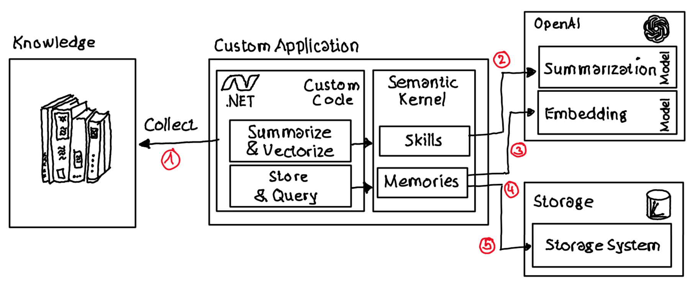

# Memories: How to vectorize, store and query data using Semantic Kernel

## Repo Content

The repo contains a simplified [c# end-to-end sample](./src/Notebook/SKMemories.ipynb) to build a knowledge base which can be queried by information workers seeking for data. The sample uses Azure OpenAI for embedding and content summarization as well as [MS Semantic Kernel](https://learn.microsoft.com/en-us/semantic-kernel/overview/) as orchestration library.

## Scenario

Information worker often need to query different data pools using to find information. The sample performs the following steps to showcase how the functionality can be implemented:




1) It downloads Wikipedia articles sample information which information workers can query. Plain c# code is used to download the articles.

2) For each article a summarization will be created using Azure OpenAI and the `gpt-35-turbo` model. To summarize an article the [Skill](https://github.com/microsoft/semantic-kernel/blob/main/docs/SKILLS.md) `SummarySkill` with the function `SimpleSummarization` is defined inline.

3) Semantic Kernel's concept of [Memories]((https://learn.microsoft.com/en-us/semantic-kernel/memories/)) is used to store article summaries with additional metadata (e.g.: Url, type ...). Semantic Kernel performs the necessary calculation of embeddings automatically.

4) Semantic Kernel's concept of Memories is also taking care of storing the embeddings in a storage system like [Qdrant](https://qdrant.tech/). For demo purposes the sample uses the in-memory `VolatileMemoryStore`.

5) Semantic Kernel's concept of Memories provides functionality to perform semantic search over "memories" (aka embeddings) stored in the storage system.

### Code Snippets

***Build Semantic Kernel with memory Storage:***

```c#
var kernelBuilder = new KernelBuilder()
    .WithAzureChatCompletionService(
        apiKey: _apiKey, 
        endpoint: _apiEndpoint, 
        deploymentName: _modelChatCompletionDeploymentName
    )
    .WithAzureTextEmbeddingGenerationService(
        endpoint: _apiEndpoint,
        apiKey: _apiKey,
        deploymentName: _modelEmbeddingDeploymentName
    )
    .WithMemoryStorage(new VolatileMemoryStore());
IKernel kernel = kernelBuilder.Build();
```

***Create memories using Semantic Kernel:***

```c#
string result = await kernel.Memory.SaveReferenceAsync(
    collection: memoryCollectionName,
    description: knowledgeSummary,
    text: knowledge,
    externalId: knowledgeUrl,
    externalSourceName: "Wikipedia"
);
```

***Query memories using Semantic Kernel:***

```c#
string query = "Where does Yoda come from?";
IAsyncEnumerable<MemoryQueryResult> searchResults = kernel.Memory.SearchAsync(memoryCollectionName, query); 

await foreach (MemoryQueryResult memory in searchResults) {
    Console.WriteLine($"{memory.Metadata.Text} : {memory.Relevance} : {memory.Metadata.Id} : {memory.Metadata.Description}");
}
```

## Summary

MS Semantic Kernel provides with the concept of Memories an abstraction layer which simplifies the calculation, storage and querying of embeddings.
